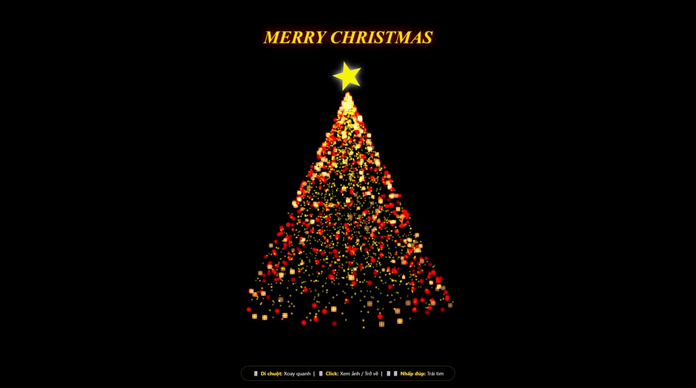

# 🎄 Noel Magic Music - Interactive 3D Christmas Tree



Dự án web tương tác 3D chủ đề Giáng Sinh, sử dụng công nghệ nhận diện cử chỉ tay (AI Hand Tracking) để điều khiển cây thông. Tích hợp trang Admin để quản lý ảnh kỷ niệm dễ dàng.

## 📂 Cấu trúc thư mục

Dựa trên cấu trúc thực tế của dự án `NOEL`:

```text
NOEL/
├── admin/                  # Trang quản trị (Upload ảnh)
│   └── index.php           # Giao diện Admin
├── music/                  # Thư mục nhạc nền
│   └── 04 Nhạc Nền...mp3   # (Tự động phát bài đầu tiên tìm thấy)
├── uploads/                # Chứa ảnh hiển thị trên cây thông
│   ├── IMG_2024...jpg
│   └── ...
├── favicon.ico             # Icon của tab trình duyệt
├── get_images.php          # API lấy danh sách ảnh (JSON) cho JS
├── index.php               # TRANG CHỦ (Giao diện 3D chính)
├── script.js               # Logic chính (Three.js + MediaPipe AI)
├── style.css               # Giao diện trang chủ
├── upload_handler.php      # Xử lý logic upload ảnh từ Admin
└── README.md               # Hướng dẫn sử dụng
```

## ✨ Tính năng

1. **Giao diện 3D (Client):**

- Cây thông 3D lung linh với hiệu ứng Bloom.
- **Điều khiển bằng tay (Webcam):** Xoay cây, chọn ảnh bằng cử chỉ.
- **Tự động tải ảnh:** Lấy ảnh từ thư mục `uploads` treo lên cây.

2. **Trang Quản trị (Admin):**

- Giao diện upload ảnh nhanh chóng mà không cần copy paste thủ công.
- Ảnh upload xong sẽ xuất hiện ngay trên cây thông ở trang chủ.

## 🚀 Hướng dẫn cài đặt

1. **Cài đặt Server:** Cài XAMPP (hoặc WAMP).
2. **Triển khai:**

- Copy thư mục `NOEL` vào trong `htdocs` của XAMPP.
- Đường dẫn: `C:\xampp\htdocs\NOEL`

3. **Chạy dự án:**

- **Trang chủ (Xem cây):** Truy cập `http://localhost/NOEL/`
- **Trang Admin (Up ảnh):** Truy cập `http://localhost/NOEL/admin/`

## 🎮 Hướng dẫn cử chỉ tay (Hand Tracking)

| Trạng thái tay     | Hành động         | Chi tiết                                                   |
| ------------------ | ----------------- | ---------------------------------------------------------- |
| **Xòe 5 ngón 🖐️**  | **Xoay cây**      | Di chuyển bàn tay để xoay cây thông 3D.                    |
| **Chụm ngón (👌)** | **Hiện con trỏ**  | Dùng để nhắm vào các bức ảnh treo trên cây.                |
| **Năm tay (✊)**   | **Mở ảnh**        | Thực hiện động tác "nắm tay lại" để phóng to ảnh được trỏ. |
| **Tim (🫶)**        | **Hiện trái tim** | Làm hình trái tim bằng 2 tay.                              |

## 🛠️ Lưu ý phát triển

- **File `get_images.php`:** Chịu trách nhiệm quét thư mục `uploads/` và trả về danh sách tên file dưới dạng JSON để `script.js` đọc được.
- **Nhạc nền:** Chỉ cần bỏ file `.mp3` vào thư mục `music/`, hệ thống sẽ tự nhận diện.

## _Code by [DazVo]_
